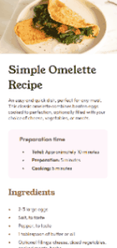

# Omelette Recipe Page 🍳
Um projeto feito como challenge do Frontend Mentor, a fim de praticar os conhecimentos adquiridos nos estudos.

## Projeto com responsividade para 420px
Clique em um dos gifs para ser redirecionado para a página do projeto.

## Tecnologias utilizadas
- HTML5
- CSS3